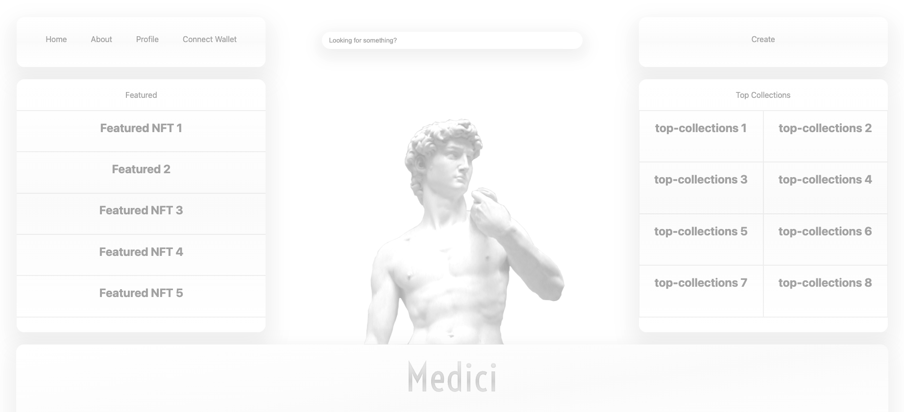

# **Medici**
## **NFT Marketplace utilizing MERN stack**
***
## Date: 03/28/2022

## By: Dylan Marvel

 ### [Github](https://github.com/marveldylan) | [Twitter](https://twitter.com/dmarv77) | [LinkedIn](https://www.linkedin.com/in/dylan-marvel/)
 ***

 ## ***DESCRIPTION***
 ### Medici is an up-and-coming NFT marketplace with a minimal aesthetic and easy-to-use UI experience. Medici focuses on enhanced storefront customization opportunities for sellers, along with a sleek profile design for users to show off their favorite NFTs! Medici's contemporary layout allows for novel ways to display NFT collections, such as a Featured Items pane and more.
 &nbsp;

 ## ***Technologies***
 

## **Homepage Screenshot**

## **Instructions for Developers (for local use)**
* Fork and clone this repo
* Navigate to project folder
  * client folder - install depencenies^ and enter npm run start in terminal
  * server folder - install dependencies^ and enter npm run dev in terminal
* Open index.html

* Front-end Dependencies:
   * npm i react-router-dom

*B ack-end Dependencies:
   * npm i nodemon
   * npm i morgan
   * npm i express mongoose

  

## ***Future Updates***
- [X] ~~Submit README.md~~
- [ ] Display Shop Collection - Read functionality
- [ ] Display Shop Reviews Collection - Full CRUD functionality
- [ ] Display NFT Collection - Full CRUD functionality
- [ ] Stretch Goal: Display NFT Series ( larger collections of NFTs)
- [ ] Stretch Goal: Implement prototype user login and exchanging of items to wallet

### **CHECK OUT MORE ON [TRELLO](https://trello.com/b/PpEb444b/medici)**
### **LINK TO [ERD](https://lucid.app/lucidchart/30309a66-1649-4c71-a1be-2caac1f08b2f/edit?invitationId=inv_79021968-9d58-4d24-8712-904751aa0537)**
### **LINK TO [React Component Hierarchy Diagram](https://lucid.app/lucidchart/80b5538e-b7b6-4727-9f27-514ff0362b3b/edit?invitationId=inv_50dd5194-427a-4fd7-aaab-b7806ade15e0)**
&nbsp;

## ***Credits***
### **ASSET MOCK-UPS BUILT WITH: [GRAVIT](https://www.designer.io/en/)**
### **ERD AND COMPONENT HIERARCHY DIAGRAM CREATED WITH: [Lucidchart](https://www.lucidchart.com/pages/)**
### **David Image: [duckduckgo search](https://external-content.duckduckgo.com/iu/?u=https%3A%2F%2Fi1.pngguru.com%2Fpreview%2F841%2F447%2F599%2Fs-008-aesthetic-png-clipart.jpg&f=1&nofb=1)**
### **MERN Stack Image: [duckduckgo search](https://external-content.duckduckgo.com/iu/?u=https%3A%2F%2Fwww.cmarix.com%2Fblog%2Fwp-content%2Fuploads%2F2019%2F09%2FMern.jpg&f=1&nofb=1)**
